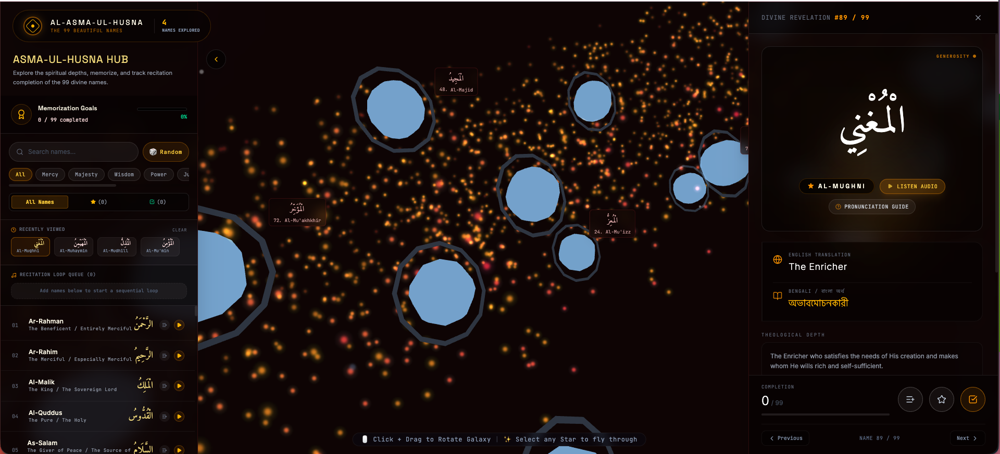

# 🌌 99 Names of Allah (Al-Asma-ul-Husna) — Interactive 3D Galaxy

An immersive, visually stunning 3D WebGL Web Application that visualizes the 99 Beautiful Names of Allah (Al-Asma-ul-Husna) as stars in a dynamic celestial galaxy. Users can explore, memorize, listen to pronunciations, queue names in a recitation loop, and receive deep, AI-generated contemplative reflections powered by Google Gemini.

---

## 📸 App Preview



---

## ✨ Features

### 1. 🌌 Interactive 3D Celestial Galaxy Visualization (WebGL)
* Renders the 99 Divine Names as interactive star nodes floating in 3D space using **Three.js** and **React Three Fiber**.
* Supports responsive, smooth gesture controls for Orbit, Pan, and Zoom (drag to rotate, scroll/pinch to zoom, double-click to view node).
* 6 distinct **Celestial Architectures (Formations)** to reorganize the layout of the stars dynamically:
  * **Spiral**: The classic golden ratio spiral galaxy formation.
  * **Nebula**: An expansive, ring-like stellar dust structure.
  * **Cluster**: Stellar clusters grouped by divine attribute categories.
  * **Wave**: A shimmering sinusoidal wave flowing through space.
  * **Supernova**: An explosive outer-expanding constellation.
  * **Infinity**: The double-loop geometry of the infinity symbol.

### 2. 🎨 Premium Celestial Aesthetics & Themes
* 6 curated theme palettes with custom glow maps, stars, and atmospheric background gradients:
  * **Slate**: Deep cosmic space slate with cool sky-blue accents.
  * **Gold**: Warm sacred desert theme with shimmering golden highlights.
  * **Emerald**: Mystic green theme evoking a lush celestial oasis.
  * **Rose**: Soft, dreamy rose-quartz nebulous gas clouds.
  * **Ruby**: Contemplative deep crimson flame space-scape.
  * **Nebula**: Vibrant cosmic cyberpunk violet and indigo fields.
* **Zen Mode**: Instant toggle to hide HUD panels, sidebars, and control desks for distraction-free contemplation of the rotating galaxy.

### 3. 🧠 Contemplative Gemini AI Meditations
* Seamlessly integrates with **Gemini 3.5 Flash** through a secure local Express server proxy.
* Generates bespoke, poetically elegant, and spiritually deep contemplative thoughts (strictly under 60 words) on how to internalize the qualities of each Divine Name in daily life.

### 4. 🔊 Web Audio Synthesis & Speech Pronunciation
* **Ambient Drones**: Generates unique Web Audio API synthesizer drone soundscapes matching each color theme.
* **Sleep Timer**: Configure 15, 30, or 60-minute sleep timers that fade the ambient drone volume out smoothly in the final 5 seconds.
* **Chime Harmonies**: A custom sound generator that produces celestial chiming arpeggios based on Solfeggio frequencies derived from the Name's ID.
* **Arabic Pronunciation**: Integrates client-side Speech Synthesis (`ar-SA`) to clearly recite each name with optimized tempo (0.72x) and pitch.

### 5. 📝 Progress Tracking & Memorization
* Mark names as **Favorite** or **Memorized/Completed**.
* **Memorization Tracker**: Tracks exploration coverage and completion percentages.
* **Certificate of Completion**: Awarded with a high-fidelity downloadable visual certificate when all 99 names are marked as completed.

### 6. 🔄 Recitation Loop Playlist Queue
* Queue custom playlists of names to play in an automatic sequence (ideal for passive listening, learning, and memorization).
* Load presets: All Names, Favorites, or specific attribute categories.

### 7. 📶 Cloud & Offline Sync (Firebase + Local Fallback)
* Supports full cloud sync via Firebase Authentication (Email/Password or Guest/Anonymous account creation).
* Saves checklists and favorite lists in Cloud Firestore, with an automatic local-storage fallback and synchronization merger upon logging back online.

---

## 📂 Project Structure

```
.
├── .env.example               # Template for environment variables (GEMINI_API_KEY, APP_URL)
├── .gitignore                 # Git ignore configuration
├── README.md                  # Project documentation (this file)
├── app-view.png               # Main screenshot interface
├── assets/                    # Static assets & workspace config files
├── firebase-applet-config.json # Firebase connection credentials
├── firebase-blueprint.json    # Firestore schema documentation
├── firestore.rules            # Firestore security rules
├── index.html                 # Entry point HTML document
├── metadata.json              # Applet metadata configuration
├── package.json               # Node packages and build scripts
├── server.ts                  # Express Backend server with Vite SSR dev middleware
├── tsconfig.json              # TypeScript configuration
├── vite.config.ts             # Vite bundler configuration
└── src/                       # React frontend source files
    ├── App.tsx                # Main App entry page (layouts, panels, filters)
    ├── audio.ts               # Web Audio API Synth Engine & Arabic Speech controller
    ├── firebase.ts            # Firebase app init & configuration exports
    ├── index.css              # Custom styles & Tailwind configurations
    ├── main.tsx               # React DOM render script
    ├── namesData.ts           # Precompiled database of the 99 Names
    └── components/            # Interactive sub-components
        ├── AuthDialog.tsx          # Login & Signup modal cards
        ├── CertificateModal.tsx    # Completion certificate award card
        ├── GalaxyCanvas.tsx        # Three.js 3D WebGL Canvas
        ├── GestureTutorial.tsx     # 3D navigation tutorial overlay
        ├── NotificationHub.tsx     # Toast and active alerts stack
        └── PronunciationGuide.tsx  # Guide for Arabic sound articulations
```

---

## 🛠️ Project Setup Guide

### Prerequisites
Make sure you have **Node.js** installed on your machine (v18.x or above recommended).

### 1. Clone & Install
Install the packages and node modules:
```bash
npm install
```

### 2. Set Up Environment Variables
Create a `.env.local` file in the root folder based on `.env.example`:
```bash
cp .env.example .env.local
```
Open `.env.local` and paste your Gemini API Key:
```env
GEMINI_API_KEY="YOUR_ACTUAL_GEMINI_API_KEY"
APP_URL="http://localhost:3000"
```

### 3. Start Development Server
Run the local application. This starts the Express server which proxies API calls to Gemini and hosts the Vite dev client:
```bash
npm run dev
```
Open your browser and navigate to: `http://localhost:3000`

### 4. Build for Production
To bundle the project for a production release:
```bash
npm run build
npm start
```

---

## 🔥 Firebase Setup Guide

To enable cross-device progress tracking, user database storage, and secure authentication:

### 1. Create a Firebase Project
1. Open the [Firebase Console](https://console.firebase.google.com/).
2. Click **Add project**, name it, and follow the creation wizard.

### 2. Add a Web Application
1. Click the Web icon (`</>`) on the Project Overview page to register a new web app.
2. Copy the credentials config object.

### 3. Update Project Configurations
Paste your credentials into `firebase-applet-config.json` and/or `src/firebase.ts`.
Example format:
```json
{
  "projectId": "your-project-id",
  "appId": "your-app-id",
  "apiKey": "your-api-key",
  "authDomain": "your-project-id.firebaseapp.com",
  "firestoreDatabaseId": "your-database-id",
  "storageBucket": "your-project-id.firebasestorage.app",
  "messagingSenderId": "your-sender-id"
}
```

### 4. Enable Authentication Providers
1. Go to **Build** -> **Authentication** in your Firebase console.
2. Click **Get Started**.
3. Under the **Sign-in method** tab, enable **Email/Password**.
4. *(Optional)* Scroll down and enable **Anonymous** sign-in (Guest Accounts).

### 5. Create Cloud Firestore Database
1. Go to **Build** -> **Firestore Database** and click **Create Database**.
2. Start in test mode or production mode.
3. Keep the custom database ID matching the name in `src/firebase.ts`, or modify `src/firebase.ts` to use the default `(default)` database.

### 6. Set Up Security Rules
Go to the **Rules** tab in Firestore, copy and paste the contents of `firestore.rules` (which allows logged-in users to only read and write data belonging to their own user ID), then click **Publish**:
```javascript
rules_version = '2';
service cloud.firestore {
  match /databases/{database}/documents {
    match /{document=**} {
      allow read, write: if false;
    }
    match /user_data/{userId} {
      allow read, write: if request.auth != null && request.auth.uid == userId;
    }
    match /users/{userId} {
      allow read, write: if request.auth != null && request.auth.uid == userId;
    }
  }
}
```

---

## 🤖 Gemini AI Reflections Configuration

Meditative thoughts are requested from the client and processed on the backend Express server via the `server.ts` proxy endpoint (`POST /api/gemini/meditation`).
1. When a user clicks **"Request Contemplative Reflection"** on a Name's detail page, a fetch request is dispatched to `/api/gemini/meditation`.
2. The server creates a customized theological prompt with the selected Name's attributes (Transliteration, Arabic characters, translation meaning).
3. The server calls the `@google/genai` library client with model `gemini-3.5-flash` and returns the generated quote to the client UI.

Ensure your `GEMINI_API_KEY` in `.env.local` is correct to prevent reflection errors.

---

## 🛠️ Built With
* **React 19 & TypeScript**: Component layer and reactive state management.
* **Three.js & OrbitControls**: 3D particle system star simulation.
* **Tailwind CSS v4**: Beautiful, custom responsive glassmorphism styles and color schemes.
* **Framer Motion**: Smooth entry layouts and interaction animations.
* **Express & TSX**: Node development backend API proxying.
* **Google Gemini AI SDK**: Reflective quote generation.
* **Firebase (Auth & Firestore)**: Progress database and state synchronizer.
# 99-names-of-allah-3d-galaxy
